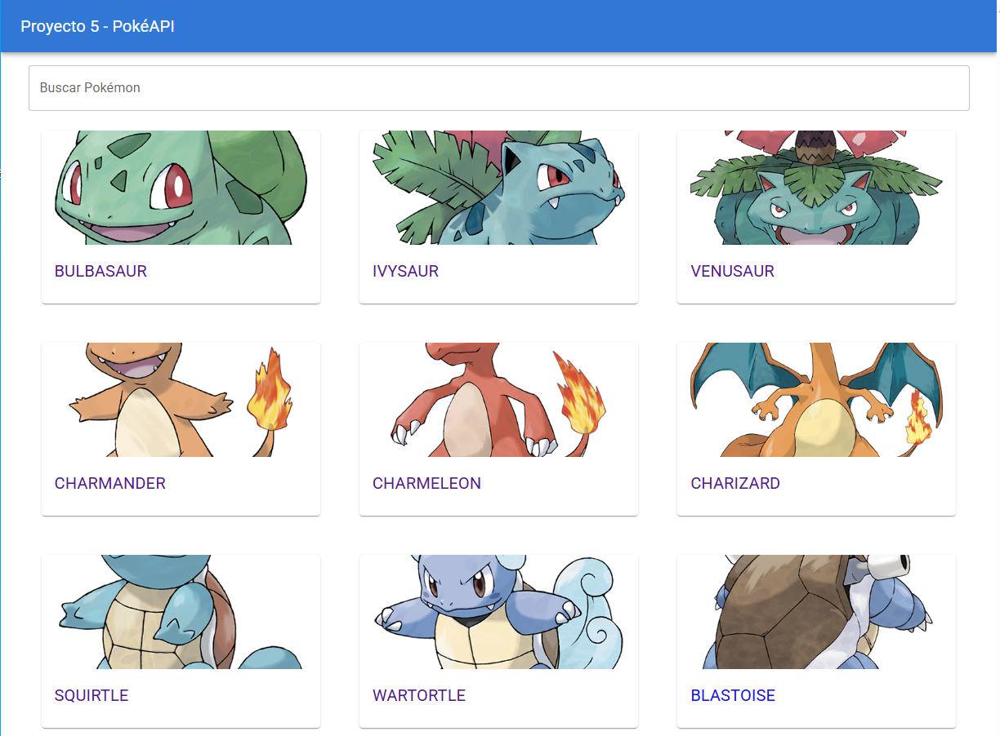
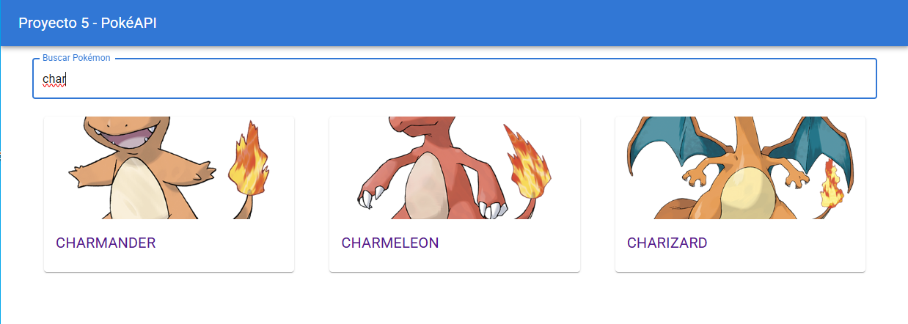
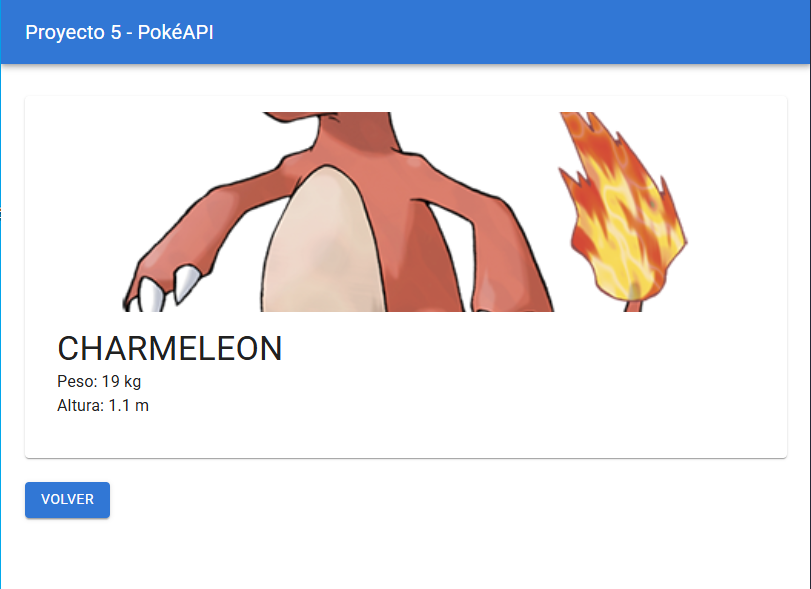

# Proyecto 5 - PokéAPI

Este proyecto es una aplicación web desarrollada con **React** que consume datos de la **PokéAPI** para mostrar una lista de Pokémon y sus detalles. Implementa **React Router**, **Material-UI**, y un sistema de búsqueda interactivo.

## 🚀 Tecnologías Utilizadas
- **React con Vite** como entorno de desarrollo.
- **React Router** para la navegación entre páginas.
- **Material-UI (MUI)** para el diseño y estilización.
- **Axios** para la obtención de datos desde la **PokéAPI**.
- **Gestión de estado con Hooks (`useState`, `useEffect`)**.

---

## 📥 Instalación
1. **Clonar el repositorio**:
   ```bash
   git clone https://github.com/Alexis5900/proyecto5.git
   ```
2. **Ingresar a la carpeta del proyecto**:
   ```bash
   cd proyecto5
   ```
3. **Instalar las dependencias**:
   ```bash
   npm install
   ```
4. **Configurar variables de entorno**:
   - Crear un archivo **`.env`** en la raíz del proyecto con el siguiente contenido:
     ```env
     VITE_API_URL=https://pokeapi.co/api/v2
     VITE_APP_NAME=PokeApp
     ```
5. **Iniciar el servidor de desarrollo**:
   ```bash
   npm run dev
   ```
   La aplicación se ejecutará en: **`http://localhost:5173/`**.

---

## 📌 Uso del Proyecto
### 1️⃣ Página Principal
- Se muestra una **lista de Pokémon** obtenida desde la PokéAPI.
- Se puede **buscar Pokémon por nombre** en la barra de búsqueda.
- Cada Pokémon tiene su **imagen y nombre**, y se puede hacer clic para ver más detalles.

### 2️⃣ Página de Detalles del Pokémon
- Muestra información detallada del Pokémon seleccionado.
- Incluye su **imagen oficial, peso y altura**.
- Botón **"Volver"** para regresar a la página anterior.

---

## 📌 Estructura del Proyecto
```
/proyecto5
 ├── /public
 │   ├── images/  # Carpeta para imágenes utilizadas en el README
 ├── /src
 │   ├── /components
 │   │   ├── Navbar.jsx
 │   │   ├── PokemonCard.jsx
 │   │   ├── ErrorBoundary.jsx
 │   ├── /pages
 │   │   ├── Home.jsx
 │   │   ├── PokemonDetail.jsx
 │   ├── /hooks
 │   │   ├── useFetch.js
 │   ├── /router
 │   │   ├── router.jsx
 │   ├── main.jsx
 │   ├── App.jsx
 │   ├── index.css
 │   ├── vite.config.js
 │   ├── .env
 │   ├── .gitignore
 │   ├── README.md
```

---

## 📌 Capturas de Pantalla
### 📌 Página Principal




### 📌 Detalles del Pokémon


---

## 📌 Despliegue

